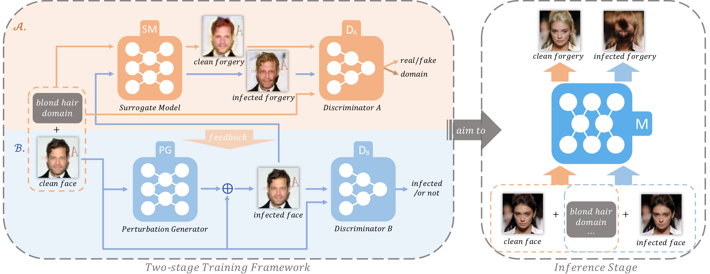

# PyTorch Implementation for Conference Paper "Initiative Defense against Facial Manipulation (AAAI 2021)"

<p align="center"></p>

This repository provides the official PyTorch implementation of the following paper:
> **Initiative Defense against Facial Manipulation (AAAI 2021)**<br>
> https://ojs.aaai.org/index.php/AAAI/article/view/16254/16061 <br>
>


## Preparation
Download pretrained models from [pretrained_model](https://drive.google.com/drive/folders/1oPzxXOP4k-X4w9GEdf2a9Pnh4Xz_Qdcx?usp=sharing) and put them into ``` ./checkpoints```. 

Download clean faces for test from [clean_faces](https://drive.google.com/file/d/1mG1CNyi0sutpA1P2B3BRWeUpUI6BlVgw/view?usp=sharing) and unzip them into ``` ./clean_faces```. 

Also, you can download the whole CeleBA dataset for test by
```bash
bash download.sh celeba
```

## Usage
For test, you can directly run the following commands:
```bash

# Test with the noise generator defense
python main.py --mode test --dataset CelebA --image_size 128 \
               --c_dim 5 --g_repeat_num 9 --batch_size 1 \
               --selected_attrs Black_Hair Gray_Hair Pale_Skin No_Beard Eyeglasses \
               --celeba_image_dir ./clean_faces --eps 0.03

# Test without the noise generator defense
python main.py --mode test --dataset CelebA --image_size 128 \
               --c_dim 5 --g_repeat_num 9 --batch_size 1 \
               --selected_attrs Black_Hair Gray_Hair Pale_Skin No_Beard Eyeglasses \
               --celeba_image_dir ./clean_faces --eps 0.03 --use_PG False
```


## Citation
If you find this work useful for your research, please cite our [paper](https://ojs.aaai.org/index.php/AAAI/article/view/16254/16061):
```
@inproceedings{huang2021initiative,
author={Qidong Huang and Jie Zhang and Wenbo Zhou and Weiming Zhang and Nenghai Yu},
title={Initiative Defense against Facial Manipulation},
booktitle={Proceedings of the AAAI Conference on Artificial Intelligence (AAAI)},
year={2021}
}
```

## License
The code is released under MIT License (see LICENSE file for details).

## Acknowledgements
This work is heavily based on [StarGAN](https://github.com/yunjey/stargan).
